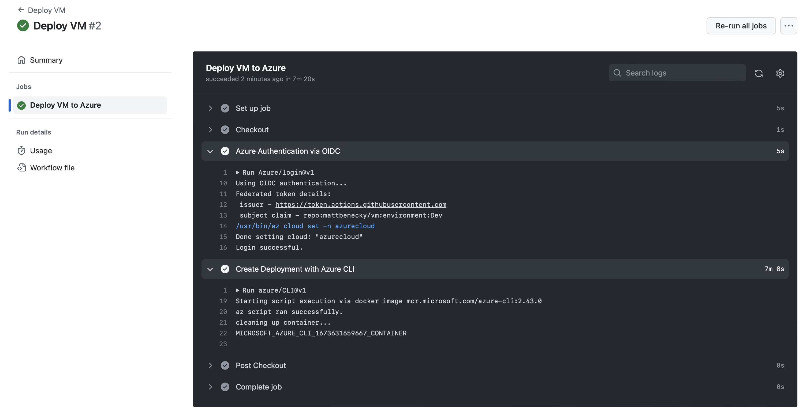

# Create a Linux Virtual Machine (VM)

This provides a sample virtual machine running ```Ubuntu Server 22.04 LTS``` in Azure. A virtual machine provides the flexibility of virtualization without having to buy and maintain the physical hardware that runs it.


## Getting Started

1. Fork this repository into your account.

2. Launch [Cloud Shell](https://shell.azure.com/bash). (Open Link in New Tab)

```COPY``` the following line 👇
```
curl -LJO https://raw.githubusercontent.com/mattbenecky/vm/main/src/infra/setup.sh && chmod +x setup.sh && ./setup.sh
```
```PASTE``` in [Cloud Shell](https://shell.azure.com/bash) & press ```ENTER```


3. Get your GitHub secrets ready:

```CLIENT_ID```
```TENANT_ID```
```SUBSCRIPTION_ID```


## Deploy Virtual Machine

1. Run GitHub Actions workflow ```Deploy VM```



## Test Virtual Machine

1. Run GitHub Actions workflow ```Test VM```

### AADSSHLoginForLinux
This validates the virtual machine integration with Azure Active Directory (Azure AD) authentication with the ```AADSSHLoginForLinux``` extension. You can use Azure AD as a core authentication platform and a certificate authority to SSH into a Linux VM by using Azure AD and OpenSSH certificate-based authentication.

### Run Command
This validates the virtual machine Run Command feature which uses the VM agent to run shell scripts remotely with ```az vm run-command```. Run Command allows you to invoke commands through the Azure API without directly connecting to the virtual machine.

### SSH
This validates connecting to the virtual machine using an ```SSH protocol 2 (SSH-2)``` RSA public-private key pair. The GitHub-hosted runner (SSH client) connects to the Azure VM using the network interface attached to the virtual machine.

## Cleaning Up

1. Launch [Cloud Shell](https://shell.azure.com/bash). (Open Link in New Tab)

```COPY``` the following line 👇
```
curl -LJO https://raw.githubusercontent.com/mattbenecky/vm/main/src/infra/cleanup.sh && chmod +x cleanup.sh && ./cleanup.sh
```
```PASTE``` in [Cloud Shell](https://shell.azure.com/bash) & press ```ENTER```
