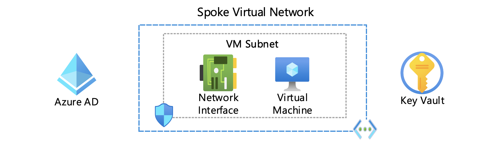
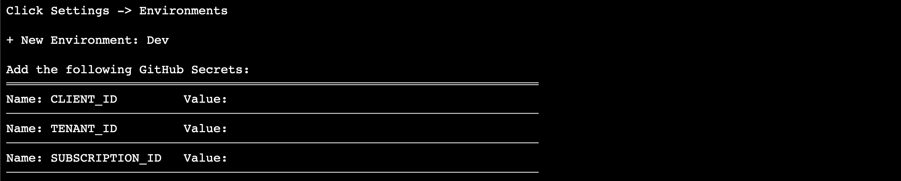
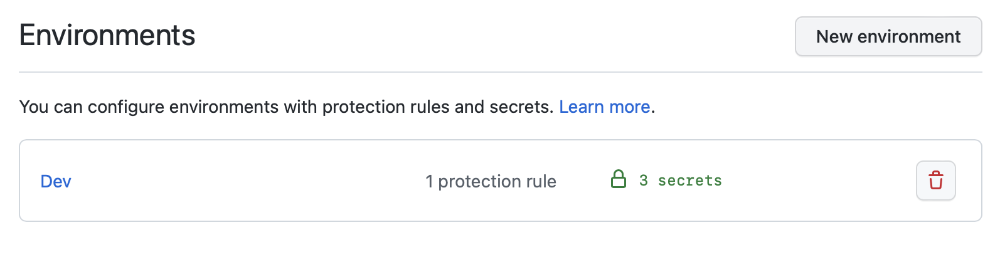

# Create a Linux Virtual Machine (VM)

This provides a sample virtual machine running ```Ubuntu Server 22.04 LTS``` in Azure. A virtual machine provides the flexibility of virtualization without having to buy and maintain the physical hardware that runs it.



## Getting Started

1. Fork this repository into your account.

2. Launch [Cloud Shell](https://shell.azure.com/bash). (Open Link in New Tab)

```COPY``` the following line 👇
```
curl -LJO https://raw.githubusercontent.com/mattbenecky/vm/main/src/infra/setup.sh && chmod +x setup.sh && ./setup.sh
```
```PASTE``` in [Cloud Shell](https://shell.azure.com/bash) & press ```ENTER```



3. Get your GitHub secrets ready:

```CLIENT_ID```
```TENANT_ID```
```SUBSCRIPTION_ID```


